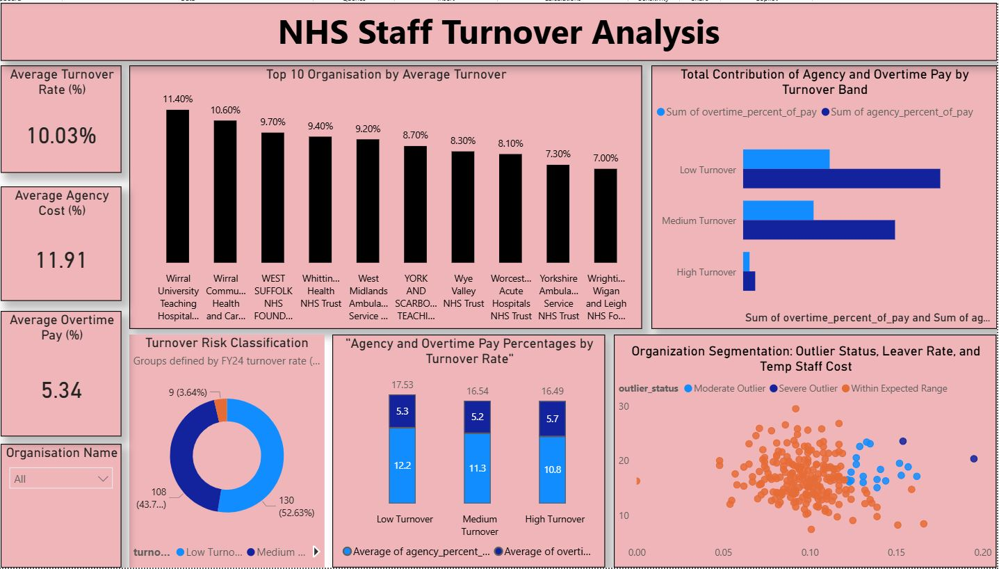

# 📊 Power BI Dashboard – NHS Staff Turnover & Financial Impact

## 📌 Overview
This folder contains the **Power BI dashboard** developed for the project  
**“Impact of Staff Turnover on the Financial Health of NHS Trusts (FY 2024/25)”**.

The dashboard is designed to translate SQL-based analysis into **clear, interactive visuals** that support workforce planning and financial decision-making.

## 🖼️ Dashboard Preview

Below is a preview of the Power BI dashboard highlighting staff turnover, temporary staffing costs, and financial risk across NHS Trusts.

---

## 🎯 Dashboard Objectives
The Power BI report answers key business questions, including:
- How staff turnover varies across NHS Trusts
- Whether high turnover is associated with higher agency or overtime spending
- Which trusts represent workforce and financial risk outliers
- How temporary staffing costs contribute to overall pay expenditure

---

## 📂 Files in This Folder
- `NHS_Staff_Turnover_Analysis.pbix` – Main Power BI report file  
- Dashboard screenshots (for preview and documentation purposes)

---

## 🧩 Data Model
The dashboard is built using cleaned and curated SQL Server views, including:
- `vw_TrustTurnoverSummary`
- Financial summary views containing agency, overtime, and total pay costs

Relationships are defined at **trust level** using `trust_code` as the primary key.

---

## 📈 Key Visuals & Metrics

### KPI Cards
- Average Staff Turnover Rate
- Agency Staff Cost (% of Total Pay)
- Overtime Cost (% of Total Pay)

### Analytical Visuals
- Top NHS Trusts by staff turnover
- Agency vs Overtime cost contribution by turnover band
- Turnover risk classification by trust
- Scatter plot highlighting financial and workforce outliers

---

## 🧠 Insights Highlighted
- High staff turnover does not always correspond to the highest agency spend
- Some low-turnover trusts show heavy reliance on temporary staffing
- Financial sustainability risk is driven by staffing cost structure rather than turnover alone
- A small number of trusts contribute disproportionately to financial risk

---

## 🛠️ Tools & Techniques Used
- Power BI Desktop
- SQL Server (views and transformations)
- DAX for calculated measures and KPIs
- Data modelling and relationship management
- Interactive filtering and drill-down analysis

---

## 🚀 How to Use
1. Download the `.pbix` file
2. Open it using **Power BI Desktop**
3. Refresh data (if SQL Server connection is available)
4. Explore visuals using filters and slicers

---

## 🔮 Future Improvements
- Add multi-year trend analysis
- Include budget vs actual variance
- Enhance drill-down by staff group and region
- Integrate predictive workforce risk indicators

